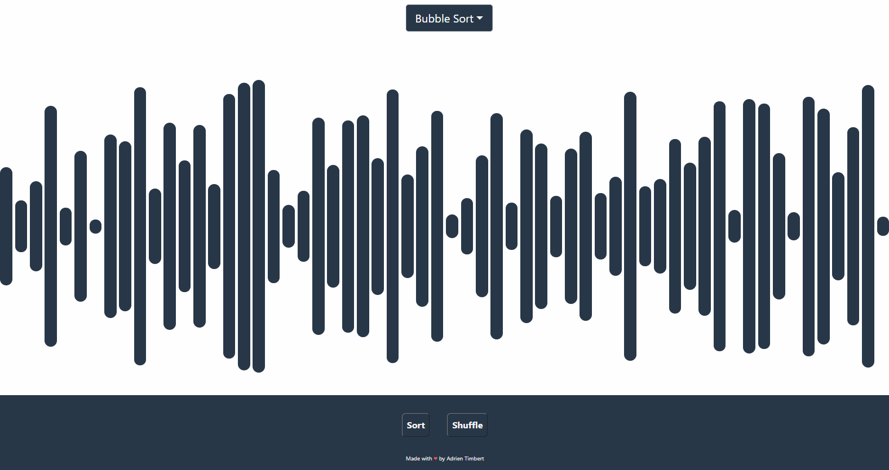
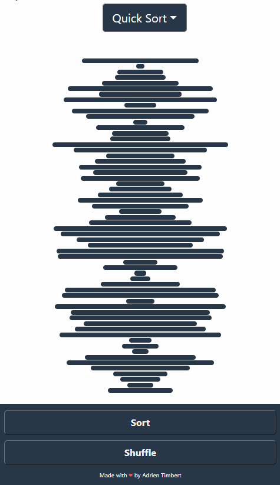

# React Sorting Algorithm Visualizer

## Table of contents 
 * [Overview](#Overview)
 * [Installation](#Installation)
 * [How to use](#How-to-use)
 * [Helpful Links](#Helpful-Links)
 * [Contributing](#Contributing)
 
## Overview
This project is a React sorting algorithms visualizer. The user can visualize how a given algorithm sort a random list. The goal of this project was to enhance my React/JS/CSS skills. 

## Installation
Try it online [here](https://keen-jepsen-125f97.netlify.app/)

Or download the source code and run using [Node](https://docs.npmjs.com/downloading-and-installing-node-js-and-npm) 
```bash
$ npm start
```
Open http://localhost:3000 to view it in the browser.

## How to use
 
- Pick an algorithm at the top and click "Sort" to visualize it.

 
<p align="left">
 
<p>
 
 
 
 
 - The app is mobile user friendly:
 
<p align="left">
 
<p>
 


## Helpful Links
* [Clément Mihailescu's tutorial](https://github.com/clementmihailescu/Sorting-Visualizer-Tutorial)
* [Wikipedia for sorting algorithms](https://en.wikipedia.org/wiki/Sorting_algorithm)
* [Geeks For Geeks's tutorials](https://www.geeksforgeeks.org/sorting-algorithms/)
* [Getting started with React](https://reactjs.org/docs/getting-started.html)
* [Deploy your React app Logrock Blog article](https://blog.logrocket.com/8-ways-to-deploy-a-react-app-for-free/)
* [CSS's Tricks guide on flexboxes](https://css-tricks.com/snippets/css/a-guide-to-flexbox/#prop-align-items)


## Contributing
Pull requests are welcome. For major changes, please open an issue first to discuss what you would like to change.

Please make sure to update tests as appropriate.
 
- - -
© 2021 Adrien TIMBERT github.com/aleolux - All Rights Reserved.
